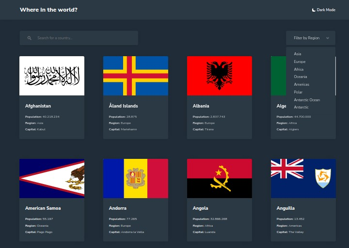

# Frontend Mentor - REST Countries API with color theme switcher solution

This is a solution to the [REST Countries API with color theme switcher challenge on Frontend Mentor](https://www.frontendmentor.io/challenges/rest-countries-api-with-color-theme-switcher-5cacc469fec04111f7b848ca). Frontend Mentor challenges help you improve your coding skills by building realistic projects. 

## Table of contents

- [Overview](#overview)
  - [The challenge](#the-challenge)
  - [Screenshot](#screenshot)
  - [Links](#links)
- [My process](#my-process)
  - [Built with](#built-with)
  - [What I learned](#what-i-learned)
  - [Continued development](#continued-development)
  - [Useful resources](#useful-resources)
- [Author](#author)
- [Acknowledgments](#acknowledgments)

## Overview

### The challenge

Users should be able to:

- See all countries from the API on the homepage
- Search for a country using an `input` field
- Filter countries by region
- Click on a country to see more detailed information on a separate page
- Click through to the border countries on the detail page
- Toggle the color scheme between light and dark mode *(optional)*

### Screenshot



### Links

- Solution URL: [https://github.com/Cdrn19/rest-countries-api-with-color-theme-switcher](https://github.com/Cdrn19/rest-countries-api-with-color-theme-switcher)
- Live Site URL: [https://cdrn19-rest-countries-api.netlify.app/](https://cdrn19-rest-countries-api.netlify.app/)

## My process

### Built with

- Semantic HTML5 markup
- CSS custom properties
- Flexbox
- Responsive Desing 
- ECMAScript 6 
- [React](https://reactjs.org/) - JS library
- [Webpack](https://webpack.js.org/) - Static module bundler
- [SASS](https://sass-lang.com/) - Processor for styles

### What I learned

In the continuous development of this project, many objectives were achieved that left great lessons.

The first of these learnings is the handling of **data attributes and JavaScript**:

```js
  const handleClick = () => {
    const changeMode = theme === "light" ? "dark" : "light";
    modeTheme(changeMode);
  };
  document.body.dataset.theme = theme;
```

Which modifies the `body` tag to set the CSS properties:

```html
<body data-theme="light">
```
```css
[data-theme="light"] {
    --shadow: hsl(0, 0%, 52%);
    --bg-header: hsl(0, 0%, 100%);
    --background: hsl(0, 0%, 98%);
    --text: hsl(200, 15%, 8%)
}

[data-theme="dark"] {
    --shadow: hsl(200, 15%, 8%);
    --bg-header: hsl(209, 23%, 22%);
    --background: hsl(207, 26%, 17%);
    --text: hsl(0, 0%, 100%);
    --filter: invert(94%) sepia(100%) saturate(0%) hue-rotate(226deg) brightness(108%) contrast(101%);
}
```

Enabling properties for changing the color of the theme chosen by the user.

I also learned to use **regular values ​​or regex** to modify the name of country borders. 


In the `CountrySelect.jsx` component we can find the section:

```html
<div className="countrySelect__detail--button">
```

Where a mapping of its borders is carried out:

```js
{Borders.length === 0 ? (
  <button>Not Borders</button>
) : (
  Borders?.map((border, i) => (
    <Link key={i} to={"/Country/" + border.name.toLowerCase()}>
      <button>
        {border.name.replace(/\s\(([^()][^()]*)\)/g, "")}
      </button>
    </Link>
  ))
)}
```

Using regular values ​​like `/\s\(([^()][^()]*)\)/g` to replace unnecessary values ​​which in this case would be the inner content between parentheses `" ( unnecessary content )"`.

### Continued development

I will continue to constantly learn the benefits that the **React.js** library can provide and make future implementations to improve the performance of my applications.

Also learn new ways to consume **API REST** to avoid redundant requests that delay layout and performance.

### Useful resources

- [ESlint](https://eslint.org/) - Find and fix problems in JavaScript code.
- [Prettier](https://prettier.io/) - code formatter.

## Author

- Website - [Carlos Revetti](https://cdrn19.github.io)
- Frontend Mentor - [@Cdrn19](https://www.frontendmentor.io/profile/Cdrn19)

## Acknowledgments

I want to give thanks to [Frontend Mentor](https://www.frontendmentor.io/profile/Cdrn19) website for making these projects and its community.
